# Отчёт по лабораторной работе: Работа с Git и GitHub Desktop

## 1. Используемый инструмент

Для выполнения задания использовался **GitHub Desktop**.  
Также установлен **Git CLI** для проверки базовых команд.

- Git: `git version 2.42.0`  
- GitHub Desktop: 4.6.2  
- ОС: macOS 13.6

---

## 1. Выполнены действия, повторяющие скринкаст в консоли VS Code

### 1.1 Инициализация репозитория

Командная строка:

```bash
mkdir demo-git
cd demo-git
git init
```

Состояние:

```bash
git status
# On branch main
# No commits yet
```

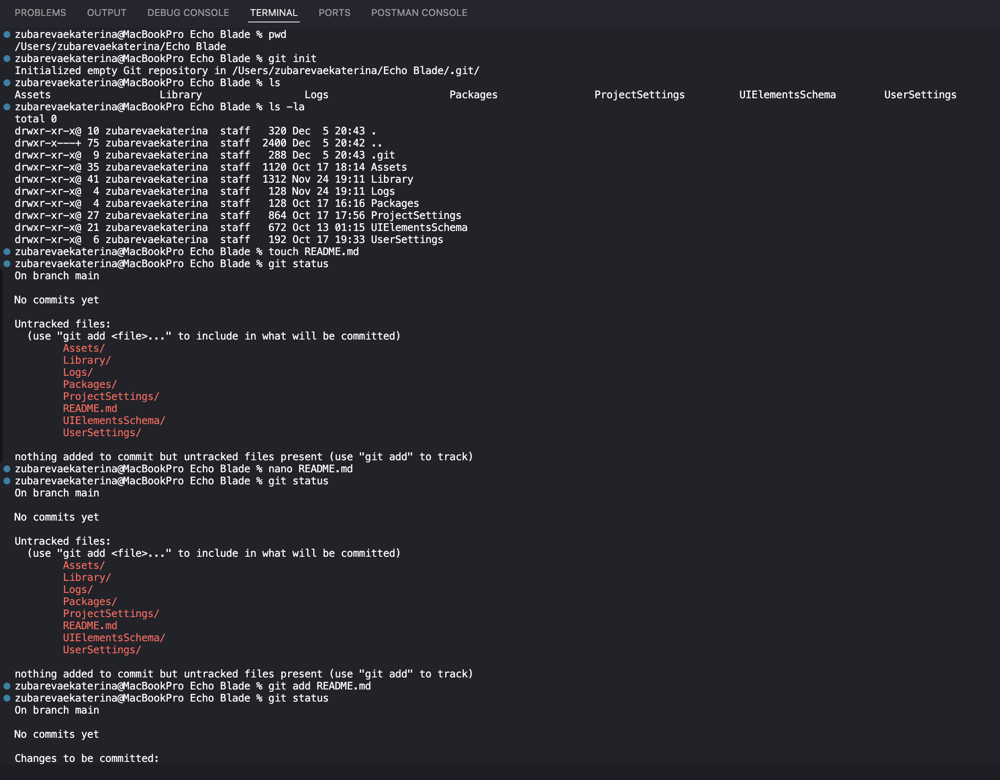

---

### 1.2 Создание файла и первый коммит

```bash
echo "Hello Git" > README.md
git add README.md
git commit -m "Initial commit with README"
```


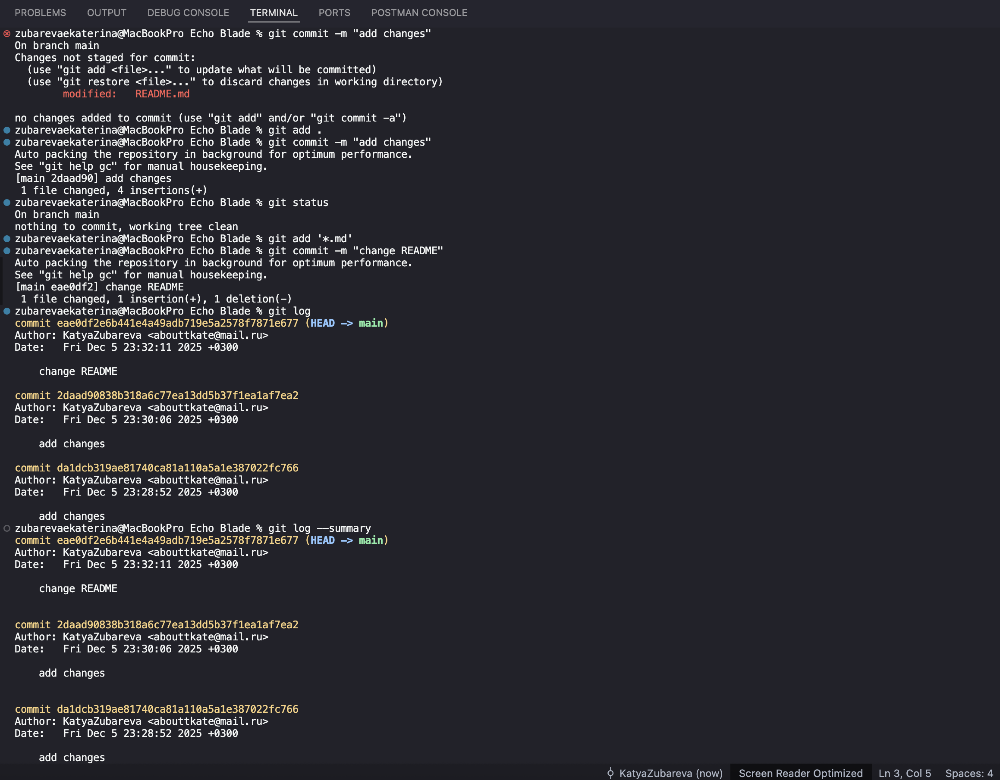

---

### 1.3 Работа с удалённым репозиторием и внесение изменений

1. Создан репозиторий на GitHub:  
   `https://github.com/USERNAME/demo-git.git`
2. Привязка удалённого репозитория:

```bash
git remote add origin https://github.com/USERNAME/demo-git.git
git push -u origin main
```

```bash
echo "Some feature work" >> README.md
git add README.md
git commit -m "Add feature-1 changes"
```

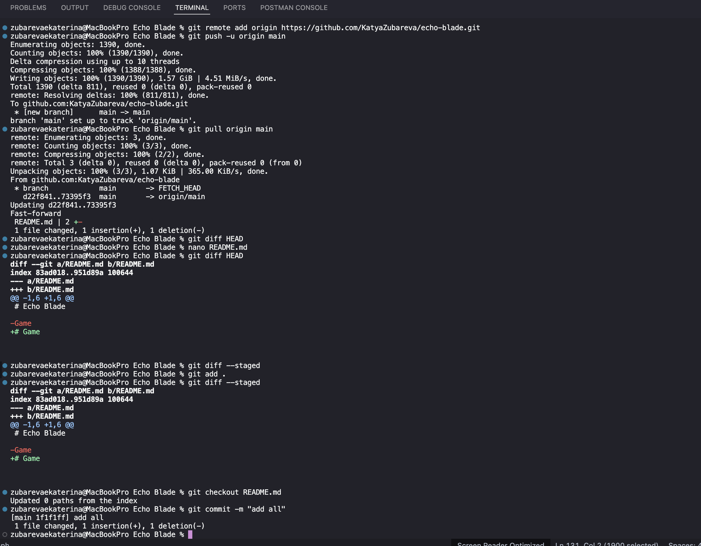

---

### 1.4 Внесение изменений и коммит в новой ветке и слияние ветки feature-1 в main

```bash
git branch feature-1
git checkout feature-1
```

Состояние:

```bash
git branch
# main
# * feature-1
```

```bash
git checkout main
git merge feature-1
```

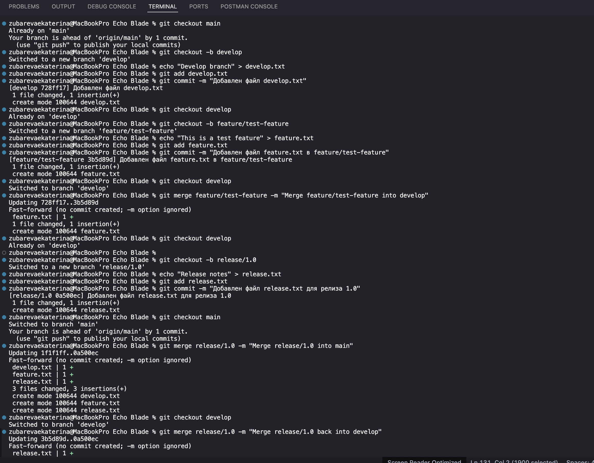

---

## 2. Использование GitHub Desktop

- Репозиторий открыт через GitHub Desktop: `File → Add Local Repository → demo-git`.
- Возможности GUI:
  - отслеживание изменений в файлах  
  - создание и переключение веток  
  - коммиты через интерфейс  
  - пуш изменений на GitHub  
- Особенности:
  - визуальная история коммитов с графиком веток  
  - наглядное сравнение изменений  
  - простое слияние веток без командной строки


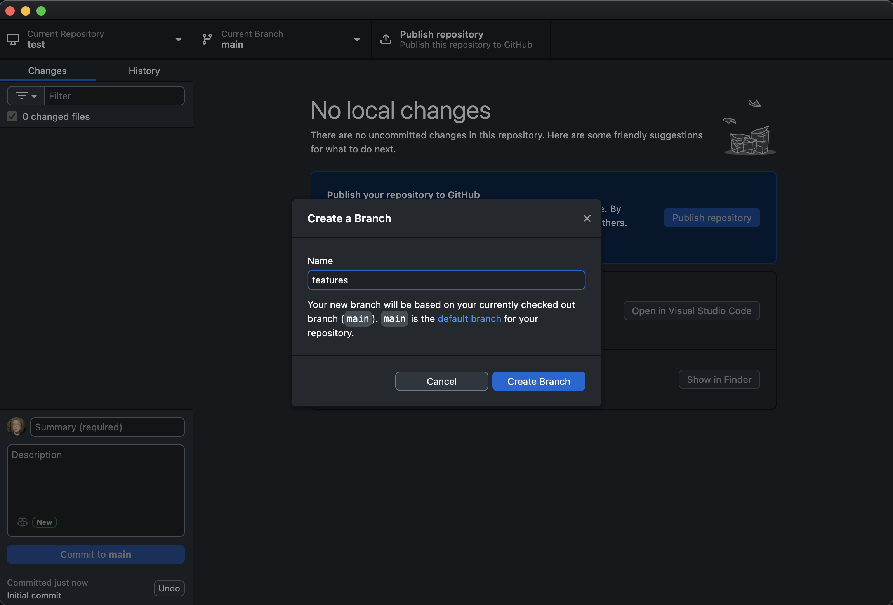
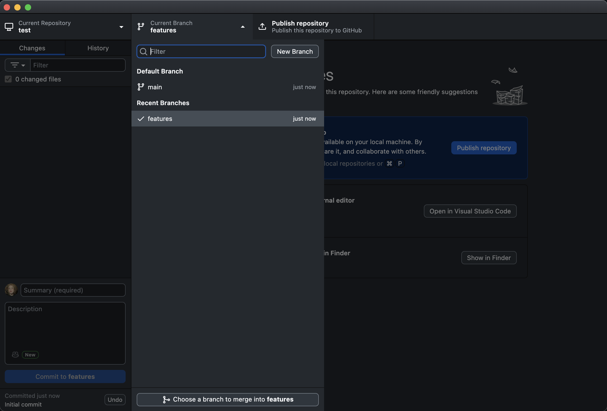
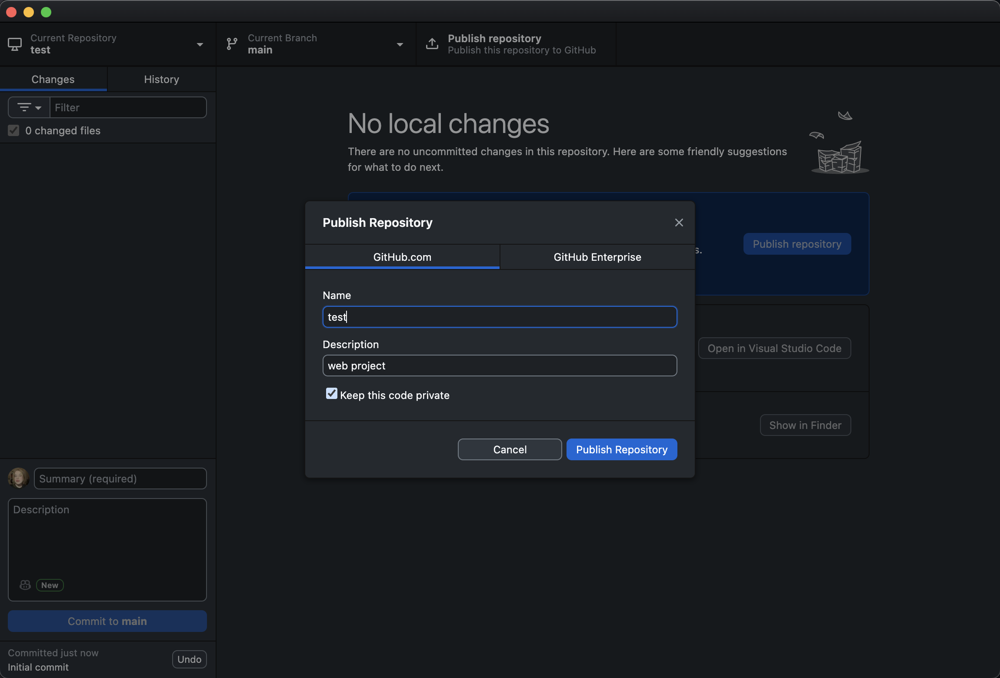
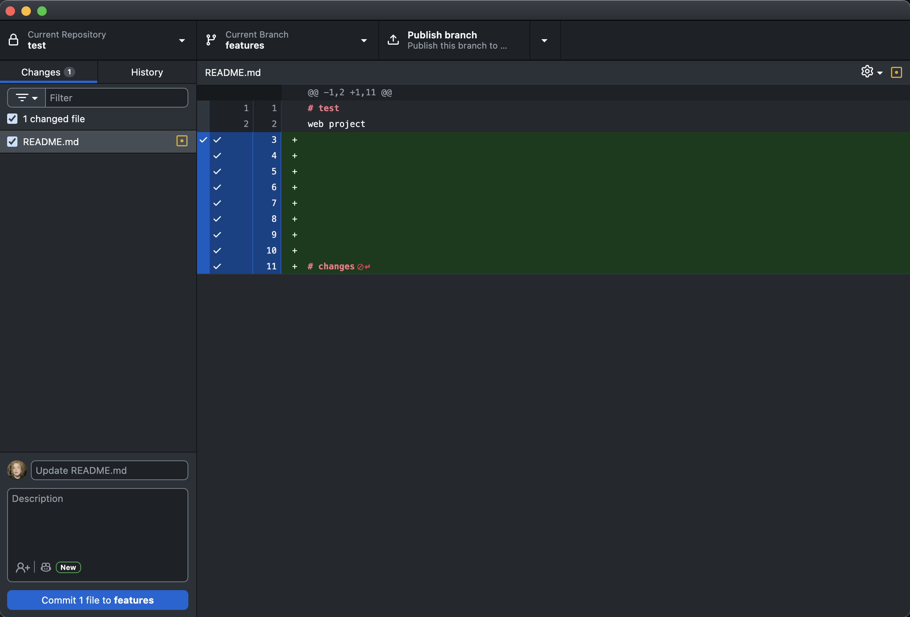
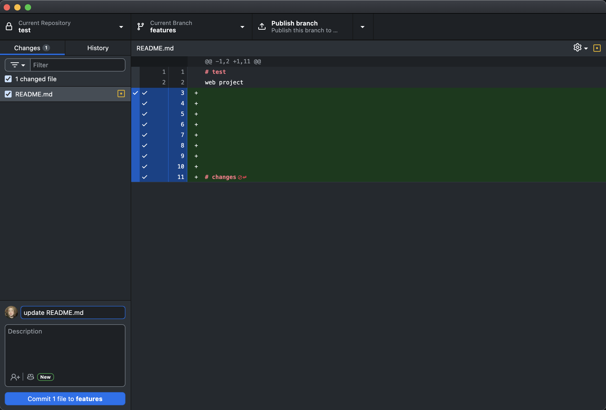
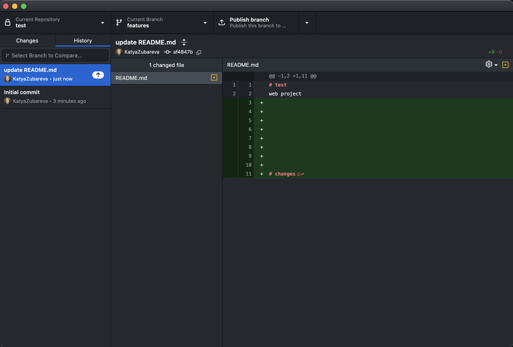

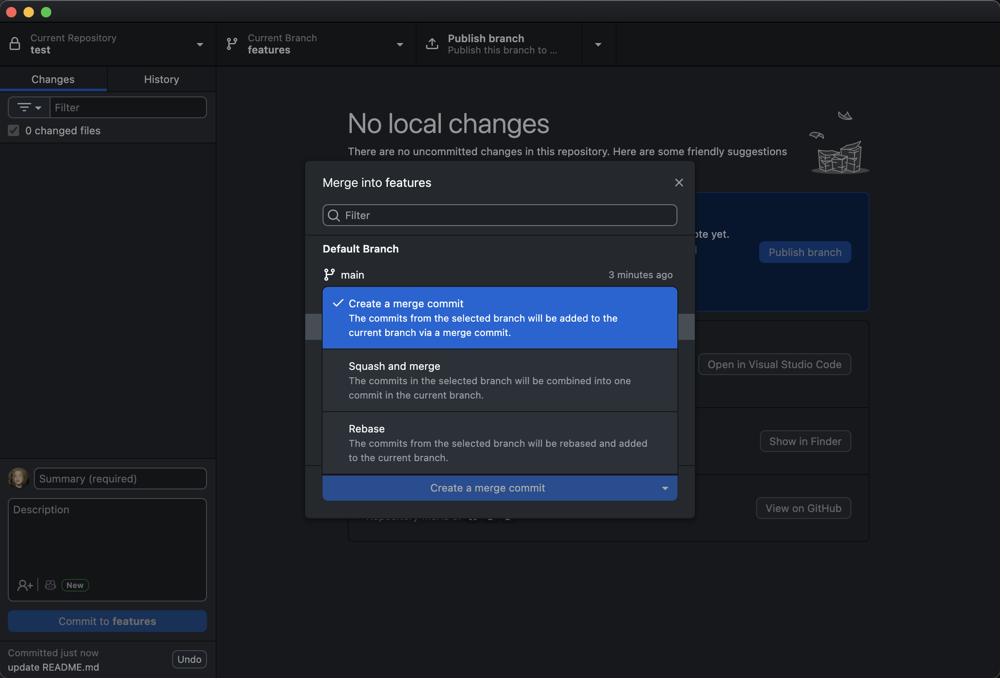
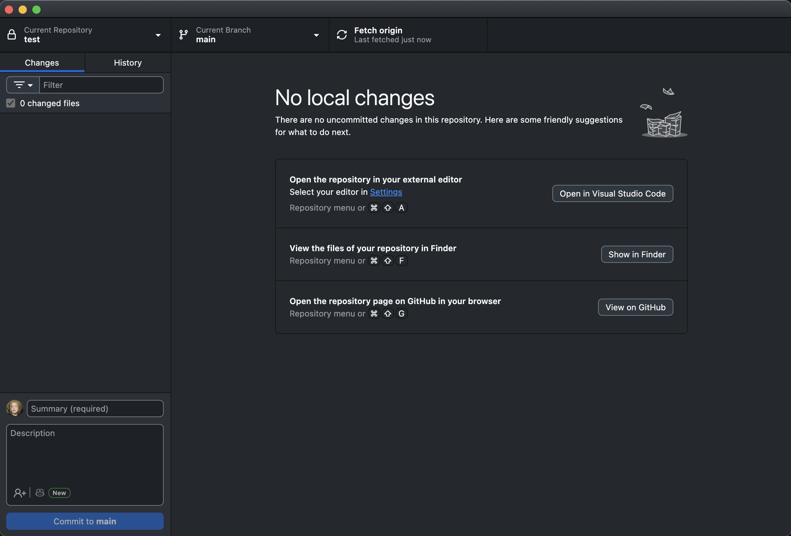
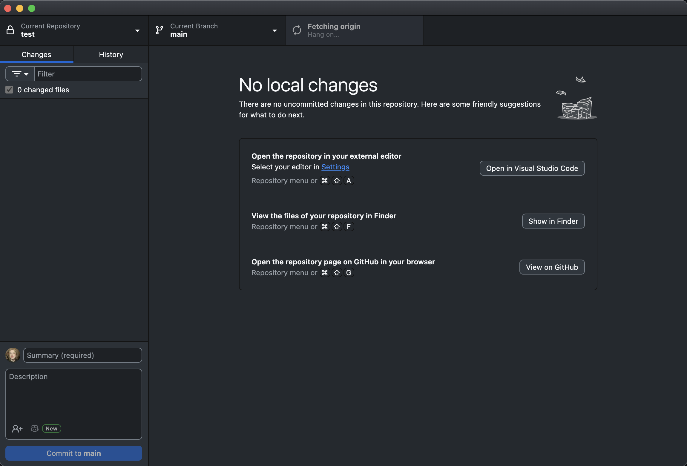

---

## 3. Выводы

- Git позволяет управлять версионностью проекта, создавать ветки, сливать их и работать с удалёнными репозиториями.  
- Десктопный клиент **GitHub Desktop** удобен для наглядного контроля изменений и коммитов без сложных команд.  
- Комбинация Git CLI и GUI клиента позволяет эффективно вести разработку и синхронизировать изменения с GitHub.

---

*Отчёт подготовлен для демонстрации основных возможностей Git и работы с GitHub Desktop.*
